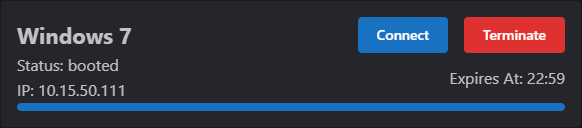
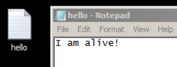

# Serve Website from Kali

In this lab, you will serve a website from Kali. You will use a Windows virtual machine to access the website. This lab can be done from the cyber.org range.

## Acceptable Use

Virtual machines in the cyber.org range have limited internet access. Do not use the range to perform any kind of attack on any resource outside of the range. Only test on authorized targets inside the range.

## Login

* Navigate to <https://apps.cyber.org/login>.
* Enter the range user name and password. The username and password will look something like:
  * Username: vphtfq
  * Password: xcbqf6yw

[Login](login.png)

Important: You cannot log in with your personal email.

* Open the classroom.

[Classroom](open_classroom.png)

## Launch Virtual Machines

* Click the **launch** buttons for the Kali Linux and Windows 7 virtual machines.

[Launch VMs](launch_vm_buttons.png)

* The virtual machines will take a few minutes to boot. You can monitor their progress.

[Booting](booting.png)

## Kali Configuration

In this section, you will configure Kali Linux to server web pages.

* Click **Connect** on the Kali Linux VM once it has finished booting.

```shell
sudo su
cd /var/www/html
echo "I am alive!" > hello.txt
systemctl start apache2
```

Now, Kali Linux is serving a website. **Note the IP address in the terminal prompt (such as 10.15.56.246).

## Windows 7 Testing

* Click **Other Machines**.


* Click **Connect** on the Windows 7 virtual machine.



* Open a web browser on the Windows desktop.
* Enter the IP address of your Kali VM in the URL. You should see the default web server homepage.


* Add **/hello.txt** to the url. You should see the contents of the file you created on the Kali VM.


* Right-click in the browser and choose "Save as...".


* Choose the Desktop folder, and click Save.


* Close the browser.
* The "hello" text file should be on the desktop. Double-click it to open it.



## Challenge 1

* Create another text file in the Kali /var/www/html directory.
* Download the file in the Windows VM.

## Challenge 2

* Create an HTML file in the Kali /var/www/html directory using **nano**.
* Add several HTML elements like lists, paragraphs, and headings.
* Load the web page in the Windows VM.

## Challenge 3

* Edit hello.txt using **nano**.
* Reload hello.txt in the Windows VM.

## Learning Summary

In this exercise you:

* Launched a Kali Linux and a Windows virtual machine.
* Created files in the Kali Linux web server root (`/var/www/html`).
* Launched the web server software (`systemctl start apache2`)
* Loaded those files from the Windows VM using a web browser using the Kali Linux IP address.
* Saved files to the Windows desktop.

## Reflection

* Is this an effective way to transfer files between computers?
* What other ways could there be to move files between computers?
